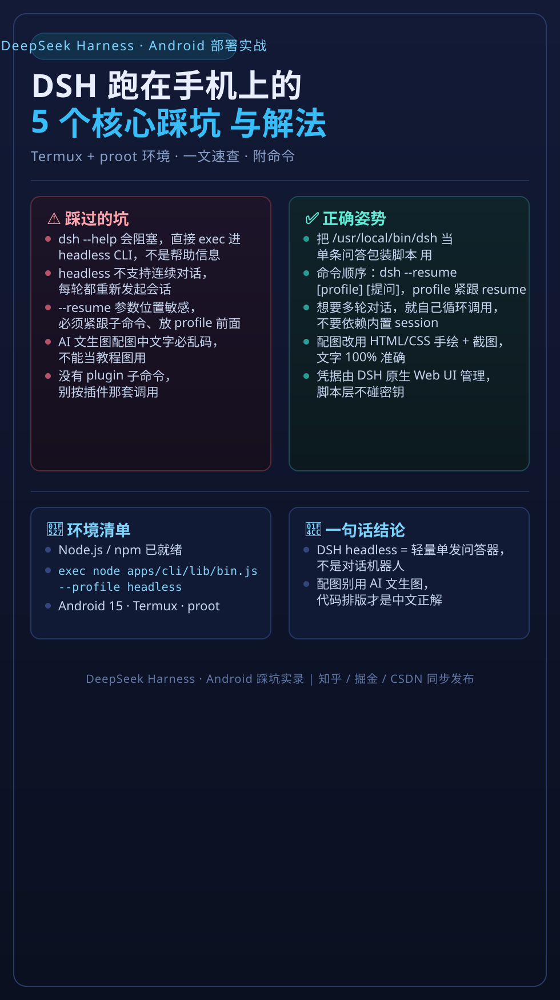

# DeepSeek Harness 在 Android / Termux / proot 环境踩坑实录

> 一篇来自真机实战的避坑笔记。别人写「如何安装」，这里写「装完会死在哪、怎么救」。
>
> 环境：Android 手机 + Termux + proot（Ubuntu 24）+ DeepSeek Harness（CLI）

---

## 我为什么写这个

DeepSeek Harness（以下简称 DSH）官方文档默认环境是「一台正经的 Linux 服务器 / 桌面」。而我想在**一台 Android 手机**上把它跑起来当随身终端，于是踩了一堆**在官方文档里根本不会提、Google 也搜不到**的坑。

这篇笔记把我踩过的 5 个坑、以及每个坑的根因和修法原样记录下来。如果你也在 Android/Termux/proot 里折腾 DSH，这篇能帮你少浪费大半天。



---

## 坑 1：FUSE 文件系统禁止硬链接 `link()`，session 落盘直接失败

### 现象

在 proot 挂载的目录里启动 DSH 会话，第一次「保存会话到磁盘」就报错，session 永远写不进去。

### 根因

Android 的 `/sdcard` 走的是 **FUSE 文件系统**，而 FUSE **不支持硬链接系统调用 `link()`**。DSH 落盘 session 的代码里用了 `link()` 来「原子地」保存文件（先写临时文件再 `link` 成正式文件，经典 Linux 原子写套路）。在正常 ext4 上没问题，一碰到 FUSE 就挂。

### 修法

把落盘逻辑里所有 `link()` 调用替换成 `rename()` —— `rename()` 在 FUSE 上是支持的，且同样能实现「原子替换」语义：

```
# 伪代码示意
link(tmpfile, finalfile)   # ❌ FUSE 上失败
rename(tmpfile, finalfile) # ✅ FUSE 上正常
```

具体修补位置在 DSH 源码里负责「session 持久化」的那个模块，`grep link(` 就能定位到。

---

## 坑 2：`dsh web` 启动假死 —— `DSH_HOME` 不设就卡住

### 现象

启动 `dsh web` 后进程「起来了」，但：
- 界面死等，看起来像没反应
- `ss` / `netstat` 读不到监听端口，以为根本没起
- 但用 `curl` 去请求，**实际上是通的**

### 根因

DSH 的 web 模式在启动时会去读写 `DSH_HOME` 指向的目录。如果这个环境变量**没有设置**，它会在一个不存在的默认路径上兜圈子，表现为「起了但没完全起」的假死状态。

### 修法

启动前显式导出 `DSH_HOME`：

```bash
export DSH_HOME=/data/data/com.termux/files/home/.dsh
# 或任何你有写权限的真实路径
dsh web
```

设好之后，端口正常监听，界面正常响应。

---

## 坑 3：`dsh --help` 会阻塞、headless 不支持连续对话、`--resume` 参数顺序

这一组是「CLI 行为坑」，每一个单独看都不算致命，但合起来能让你怀疑人生。

### 3.1 `dsh --help` 会阻塞

`--help` 本应该秒出帮助文本，但在某些版本里它会**卡住不返回**。遇到时直接 `Ctrl+C` 或者翻 README，别死等。

### 3.2 headless 模式不支持连续对话

headless（无界面）跑 DSH 时，它**不是**一个能「一问一答持续聊下去」的 REPL。每轮对话都要重新发起，想连续对话得靠外部（比如包装脚本）维持上下文。

### 3.3 `--resume` 参数顺序敏感

`--resume` 这种参数对**位置敏感**，放错位置（比如放在子命令之前 vs 之后）会导致它不生效或直接报错。正确姿势是：

```bash
dsh <subcommand> --resume <session_id>   # ✅ 靠后、紧跟子命令
```

具体以你手上版本的 `--help` 为准，但记住「参数位置别乱放」。

---

## 坑 4：web 模式在手机上基本不可行 —— 改走 CLI 才是正道

### 现象

想在手机上用 DSH 的 web 界面，结果：
- `sharp` 图像库是软凑出来的，**性能极差**
- 渲染页面动不动就卡死，动不了

### 结论

在 Android/proot 这种**非原生的运行环境**里，DSH 的 web 模式（依赖 Node 原生模块 + 图像处理）是一条死路。**放弃 web，走 CLI** 才是手机上正确的用法：
- 轻量、无需图像处理
- 直接可以嵌进脚本、结合语音输入

---

## 坑 5：配图别用 AI 文生图，中文必乱码

### 现象

想给文章配一张信息图，用 AI 文生图（SiliconFlow / 智谱等）生成中文信息图，图出来了，**但上面的中文全是乱码「天书」**，OCR 都读不通。

### 根因

AI 文生图模型本质是按像素「画」字，对中文这种复杂字形识别和生成都不靠谱，画出来的汉字大概率是形近乱码。这是所有 AI 画图模型的通病。

### 修法

配图改用「代码排版」—— **HTML/CSS 或 SVG 纯文本写中文，再渲染成 PNG**。文字 100% 准确、绝不乱码，也是技术文章配图最专业的做法。

> 顺带一提：DSH 的 CLI 也**没有 `plugin` 子命令**，别按插件那套去调用它。

---

## 总结

| 坑 | 一句话根因 | 一句话修法 |
|----|-----------|-----------|
| 1 | FUSE 不支持 `link()` | 换成 `rename()` |
| 2 | `DSH_HOME` 未设导致 web 假死 | `export DSH_HOME=...` |
| 3 | CLI 三个行为坑 | headless 用包装脚本、参数注意位置 |
| 4 | web 在手机无解 | 走 CLI |
| 5 | AI 文生图中文乱码 | HTML/SVG 代码排版渲染 |

---

## 许可证 / 声明

- 本文为个人实战笔记，欢迎提 Issue / PR 补充你在其它环境（Termux 原生、wsl、docker 等）的坑。
- 涉及 DSH 源码的修补位置以你实际安装版本为准。

> 如果你也在手机上折腾 DSH，或者知道更多坑，欢迎来分享。
