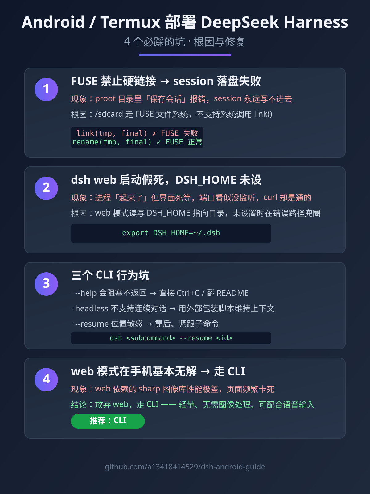

# 在 Android 手机上跑 DeepSeek Harness（DSH），我踩了 4 个官方文档不会写的坑

> 别人写「如何安装」，我写「装完会死在哪、怎么救」。

DeepSeek Harness（DSH）官方文档默认的环境是「一台正经的 Linux 服务器 / 桌面」。我偏要在一台 **Android 手机**上把它跑起来当随身终端，结果踩了一堆**官方文档根本不会提、Google 也搜不到**的坑。

下面这 4 个坑，每个都附根因和修法，原样记录。如果你也在 Android / Termux / proot 里折腾 DSH，这篇能帮你省大半天。

---

## 坑 1：FUSE 文件系统禁止硬链接，session 落盘直接失败

**现象**：在 proot 挂载的目录里启动会话，「保存会话到磁盘」那一下直接报错，session 永远写不进去。

**根因**：Android 的 `/sdcard` 走的是 **FUSE 文件系统**，而 FUSE **不支持硬链接系统调用 `link()`**。DSH 落盘 session 的代码用了 `link()` 做「原子写」（先写临时文件再 link 成正式文件，经典 Linux 原子写套路）——在正常 ext4 上没问题，一碰 FUSE 就挂。

**修法**：把落盘逻辑里的 `link()` 全换成 `rename()`。`rename()` 在 FUSE 上支持，且同样具备「原子替换」语义：

```bash
link(tmpfile, finalfile)   # ❌ FUSE 上失败
rename(tmpfile, finalfile) # ✅ FUSE 上正常
```

具体位置：DSH 源码里负责「session 持久化」的模块，`grep 'link('` 就能定位到。

---

## 坑 2：`dsh web` 启动假死，`DSH_HOME` 不设就卡住

**现象**：启动 `dsh web` 后进程「起来了」，但界面死等、像没反应；`ss`/`netstat` 读不到监听端口、以为根本没起——结果 `curl` 一测**其实是通的**。

**根因**：web 模式启动时会去读写 `DSH_HOME` 指向的目录，这个环境变量**没设置**时，它会在一个不存在的默认路径上兜圈子，表现为「起了但没完全起」的假死。

**修法**：启动前显式导出：

```bash
export DSH_HOME=/data/data/com.termux/files/home/.dsh
dsh web
```

设好之后，端口正常监听、界面正常响应。

---

## 坑 3：三个 CLI 行为坑，合起来能让你怀疑人生

**3.1 `--help` 会阻塞**：本该秒出帮助文本，某些版本却卡住不返回。遇到直接 `Ctrl+C` 或翻 README，别死等。

**3.2 headless 不支持连续对话**：无界面模式**不是**能一问一答持续聊的 REPL，每轮都要重新发起；想连续对话得靠外部包装脚本维持上下文。

**3.3 `--resume` 参数位置敏感**：放错位置（子命令前 vs 后）会导致不生效或直接报错。正确姿势：

```bash
dsh <subcommand> --resume <session_id>   # ✅ 靠后、紧跟子命令
```

---

## 坑 4：web 模式在手机上基本无解，走 CLI 才是正道

**现象**：web 模式依赖的 `sharp` 图像库是软凑出来的，**性能极差**，页面动不动就卡死。

**结论**：在 Android / proot 这种**非原生环境**里，DSH 的 web 模式（依赖 Node 原生模块 + 图像处理）是条死路。**放弃 web，走 CLI** 才是手机上正确的用法——轻量、无需图像处理、还能直接嵌进脚本配合语音输入。

---

## 总结

| 坑 | 一句话根因 | 一句话修法 |
|----|-----------|-----------|
| 1 | FUSE 不支持 `link()` | 换成 `rename()` |
| 2 | `DSH_HOME` 未设导致 web 假死 | `export DSH_HOME=...` |
| 3 | CLI 三个行为坑 | headless 用包装脚本、参数注意位置 |
| 4 | web 在手机无解 | 走 CLI |

---

## 一张图看懂四个坑



---

### 完整版 + 更多坑

如果你也在 Android / Termux / wsl / docker 里折腾 DeepSeek Harness，或者踩过这里没写到的坑，欢迎来这个仓库提 Issue 补充——一起把移动端部署这条路踩平。

📌 本文完整原文与更多命令示例见本仓库 README。
