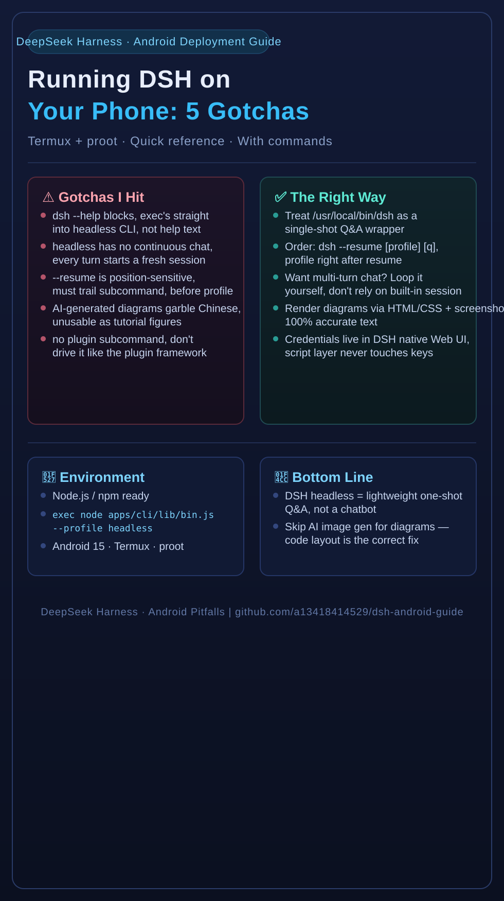

# Running DeepSeek Harness (DSH) on an Android Phone: 5 Gotchas the Official Docs Never Mention

> Everyone writes "how to install it." I write "where it dies after install, and how to save it."

DeepSeek Harness (DSH) officially assumes you're running on "a proper Linux server or desktop." I stubbornly decided to run it on an **Android phone** as a pocket terminal, and ran straight into a pile of pitfalls that **the official docs never mention and Google can't find**.

Below are the 5 gotchas, each with the root cause and the fix, documented exactly as I hit them. If you're also fighting DSH inside Android / Termux / proot, this will save you half a day.



---

## Gotcha 1: FUSE doesn't support hard links, so session persistence just dies

**Symptom**: Start a session in a proot-mounted directory, and the very first "save session to disk" throws an error. The session never gets written.

**Root cause**: Android's `/sdcard` runs on the **FUSE filesystem**, and FUSE **does not support the hard-link syscall `link()`**. DSH's session-persistence code uses `link()` to do an "atomic write" (write a temp file, then `link()` it into the final name — the classic Linux atomic-write trick). It works fine on a normal ext4, but hits FUSE and dies.

**Fix**: Replace all `link()` calls in the persistence logic with `rename()`. `rename()` is supported on FUSE and gives the same "atomic replace" semantics:

```bash
link(tmpfile, finalfile)   # ❌ fails on FUSE
rename(tmpfile, finalfile) # ✅ works on FUSE
```

Where exactly: the module in DSH's source that handles "session persistence" — `grep 'link('` will find it.

---

## Gotcha 2: `dsh web` appears to hang — because `DSH_HOME` isn't set

**Symptom**: After starting `dsh web`, the process seems "up", but:
- the UI just sits there, looks unresponsive
- `ss` / `netstat` can't find any listening port, so you think it never started
- but `curl` says it's **actually reachable**

**Root cause**: DSH's web mode reads/writes the directory pointed to by `DSH_HOME` on startup. If that env var is **not set**, it spins in circles on a non-existent default path — a "started but not fully started" zombie state.

**Fix**: Explicitly export `DSH_HOME` before starting:

```bash
export DSH_HOME=/data/data/com.termux/files/home/.dsh
dsh web
```

Set it, and the port listens properly and the UI responds normally.

---

## Gotcha 3: three CLI behavior traps that will make you question your sanity

**3.1 `dsh --help` blocks**: it should dump help text instantly, but on some versions it **hangs and never returns**. When that happens, just `Ctrl+C` or read the README — don't wait for it.

**3.2 headless mode has no continuous conversation**: the headless (no-UI) mode is **not** a one-question-one-answer REPL you can keep chatting in. Every turn has to be kicked off fresh; to get continuous conversation you need an external wrapper script holding the context.

**3.3 `--resume` is position-sensitive**: put it in the wrong place (before vs after the subcommand) and it either silently does nothing or throws. The correct form:

```bash
dsh <subcommand> --resume <session_id>   # ✅ trailing, right after the subcommand
```

---

## Gotcha 4: web mode is basically a dead end on a phone — go CLI

**Symptom**: `sharp` (the image library the web mode depends on) is software-hobbled here, and performance is **terrible** — the page freezes constantly.

**Conclusion**: Inside a **non-native environment** like Android / proot, DSH's web mode (which leans on native Node modules + image processing) is a dead end. **Drop web, go CLI** — that's the correct way on a phone:
- lightweight, no image processing needed
- can be scripted and combined with voice input

---

## Gotcha 5: don't use AI text-to-image for diagrams — Chinese text WILL come out garbled

**Symptom**: I wanted an infographic for this article, so I generated one with an AI image model (SiliconFlow / Zhipu, etc.). The image came out, but **all the Chinese text was a garbled mess**, unreadable even by OCR.

**Root cause**: AI image models essentially "paint" glyphs pixel by pixel. For complex scripts like Chinese, both recognition and generation are unreliable — the hanzi they paint are almost always near-miss garbage. This is a universal weakness of all AI image models, not any one vendor.

**Fix**: Render your diagrams with code instead — **write the text in HTML/CSS or SVG, then render to PNG**. Text is 100% accurate and never garbled. It's also the most professional way to illustrate a technical article.

> Side note: DSH's CLI also has **no `plugin` subcommand** — don't try to drive it like the plugin framework.

---

## Summary

| # | Root cause (one line) | Fix (one line) |
|---|----------------------|----------------|
| 1 | FUSE doesn't support `link()` | switch to `rename()` |
| 2 | `DSH_HOME` unset → web hangs | `export DSH_HOME=...` |
| 3 | three CLI traps | wrapper script for headless, mind arg order |
| 4 | web is hopeless on a phone | go CLI |
| 5 | AI image gen garbles Chinese | render via HTML/SVG |

---

📌 Full article + more command examples, plus the SVG source: **github.com/a13418414529/dsh-android-guide**

---

## 💛 Support this project

If this guide saved you time, here's how you can support it:

- 🍵 **Buy me a coffee**: **[ko-fi.com/zxx333](https://ko-fi.com/zxx333)**
- ⭐ **Star the repo** — it genuinely helps more people find this guide
- 💬 **Contribute**: open an Issue / PR with the gotchas you hit in other environments (wsl, docker, native Termux, etc.)
